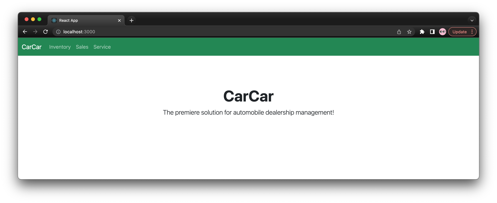
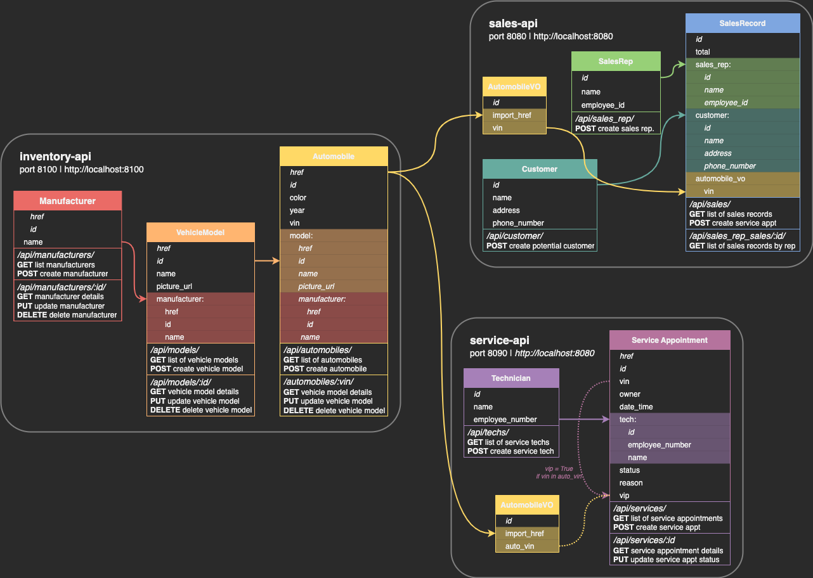

# 🚗 CarCar 🚗  
- [ ] ***add/update description about the app***  

CarCar is a webapp to manage automobile inventory, sales records, & service appointments for cars in a postgres database using an interactive react.js UI. Perfect for car dealerships!

---

## Team
* Lewey - Sales
* Holly - Service

---

## Key Features
- [ ] ***add description about different microsevices***  
- Landing page

- Inventory
- Sales Records
- Service Appointments
---
## Installation
This webapp requires [Docker Desktop](https://www.docker.com/products/docker-desktop/) to run the services. UI is  
1. Run commands in a CLI:
    - Clone the repository  
    `git clone https://gitlab.com/leweymelchor/project-beta.git`
    - Change to project diectory  
    `   cd project-beta`
    - Build docker containers & run  
    `docker-compose up --build`
2. Open in a browser [http://localhost:3000/](http://localhost:3000/)
3. Enjoy!  

---  

## Design
### API Refrerence

### Services - Docker
| Service | Image | Notes |
| --- | --- | --- |
| react | node | img tag: 12.2-bullseye |
| | |ports: 3000:3000 |
| database | postgres | img tag: 14.2-bullseye |
| | | ports: 15432:5432 |
| | | volume: beta-data |
| inventory-api | project-beta-inventory-api | ports: 8100:8000 |
| service-api | project-beta-service-api | ports: 8080:8000 |
| service-poller | project-beta-service-poller |  |
| sales-api | project-beta-sales-api | ports: 8090:8000 |
| sales-poller | project-beta-sales-poller |  |  

### Service microservice

Explain your models and integration with the inventory
microservice, here.  

### Sales microservice

Explain your models and integration with the inventory
microservice, here.

---
