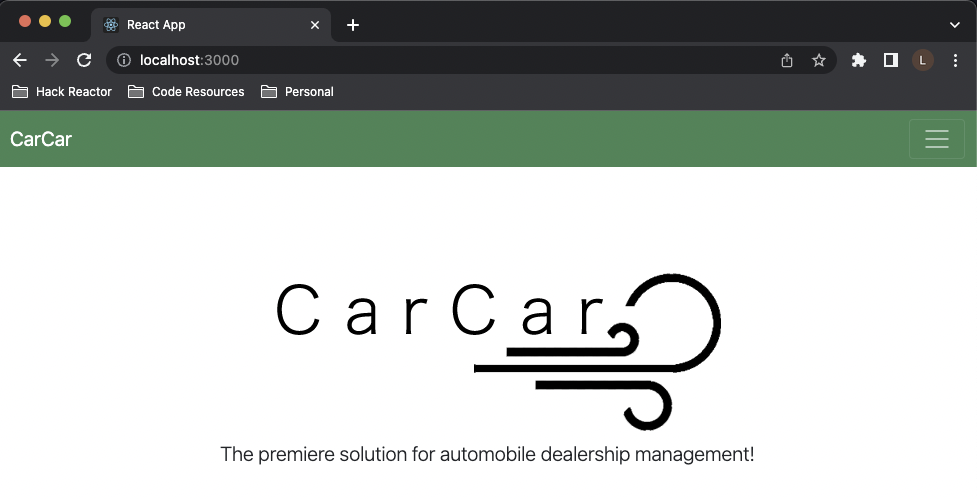
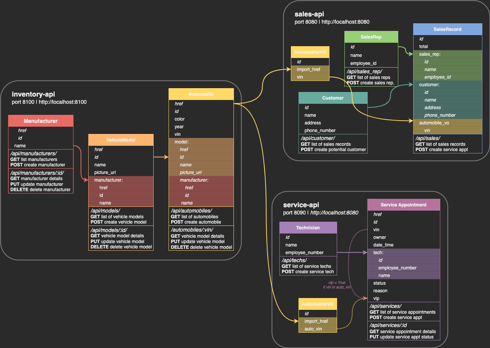
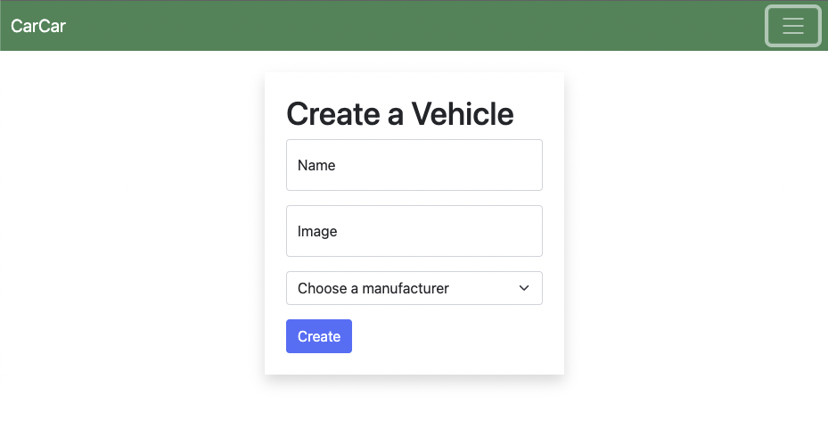
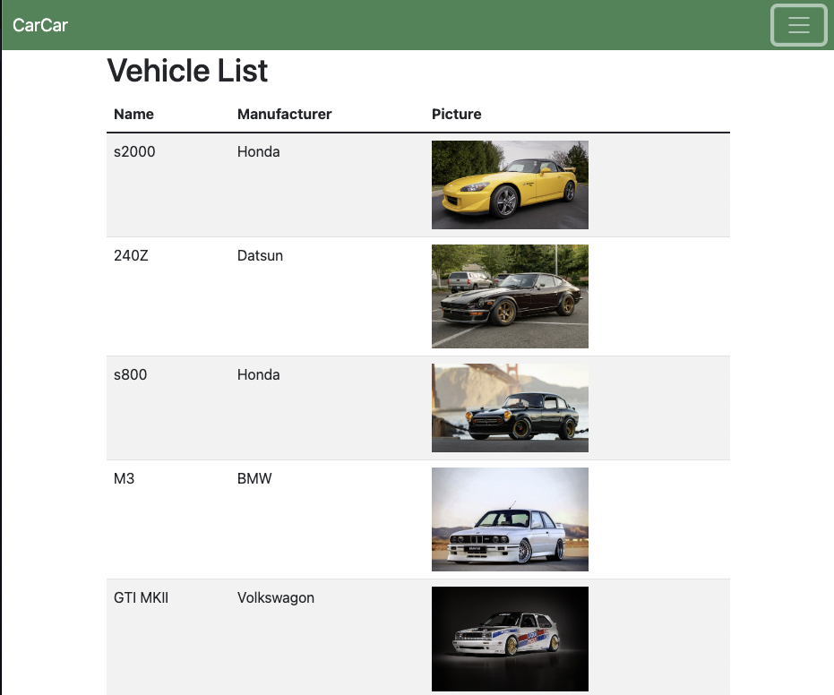
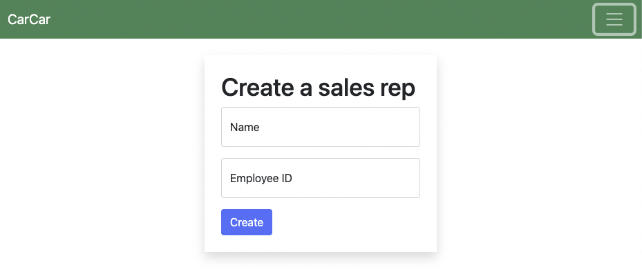
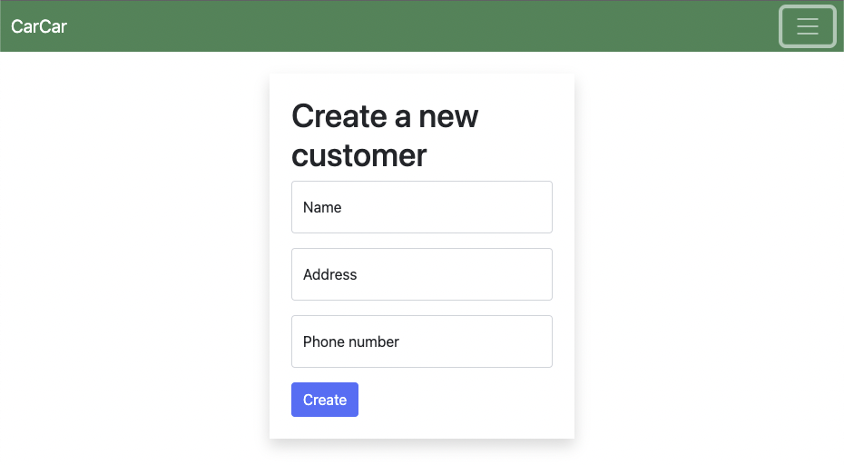
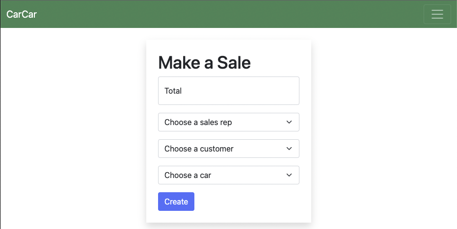
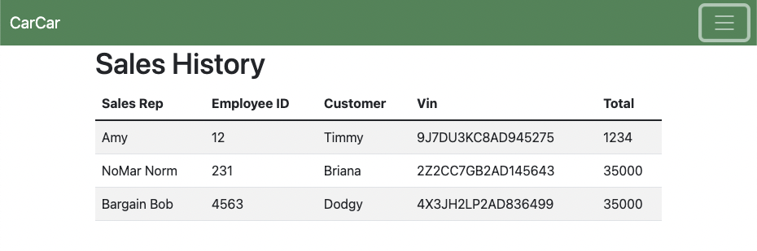
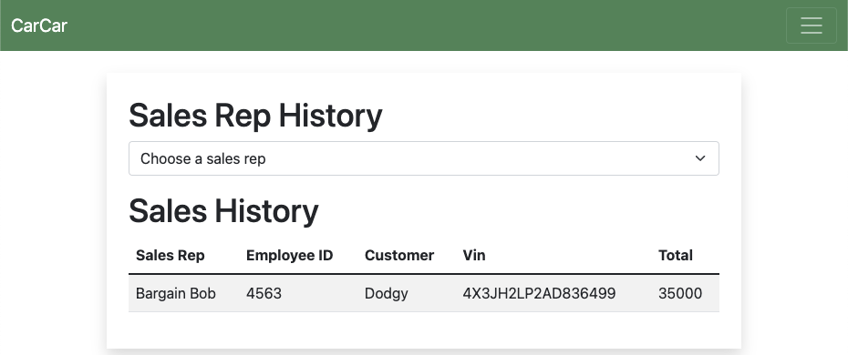

# CarCar

Team:

* Lewey - Sales
* Holly- Services

## Overview

---

> [CarCar](http://localhost:3000/) was created as a streamlined solution for storing all of your clunkers and junkers! Do you have more cars than you can count? Have your friends mentioned you might have a problem? Well we have the solution for you, no, this is not an episode of hoarders! It's a comprehensive, easy to maintain car inventory, sales, and mechanic services web application.

## Key Features

---

### Inventory 
- With CarCar you can store all of your vehicles in one place!(and no there is not an overnight storage fee!)   Keep vins, makes, models, images, prices, colors and the year of each vehicle together so you no longer need to sift through reams of paper.
### Services
- Have a mechanic business too? 
CarCar will help you manage technicians, times of service, and services performed. This will be stored along side the cars information and the customer who brought it in. We know its a VIP if the car was in our inventory before.
### Sales
- ...But wait, there's more! Easily keep track of employees, sales, and yes, even employee's sales. Get rid of that old Incorruptible Cashier and subscribe to CarCar! (only $45.99 a month or save money with our yearly subscription $535/year)

## How To Run It

---

### Requirements:

1. [Python 3](https://www.python.org/downloads/)
2. [Docker Desktop](https://www.docker.com/products/docker-desktop/)
3. [VSCode](https://code.visualstudio.com/)

### Start the app:

1. Clone the repository: `git clone https://gitlab.com/leweymelchor/project-beta.git`
2. Change to project diectory: `cd project-beta`
3. Open project `code .`
4. Open Docker app
5. Open VSCode terminal  to top level directory `control + \` `
6. Build docker containers & run: 
    `docker-compose up --build`
7. Open in a browser  [http://localhost:3000/](http://localhost:3000/)
8. Take a load off and Enjoy, the hard work is over, now it's our turn!

## Archetecture

---

### API Refrerence:

### Services - Docker
| Service | Image | Notes |
| --- | --- | --- |
| react | node | img tag: 12.2-bullseye |
| | |ports: 3000:3000 |
| database | postgres | img tag: 14.2-bullseye |
| | | ports: 15432:5432 |
| | | volume: beta-data |
| inventory-api | project-beta-inventory-api | ports: 8100:8000 |
| service-api | project-beta-service-api | ports: 8080:8000 |
| service-poller | project-beta-service-poller |  |
| sales-api | project-beta-sales-api | ports: 8090:8000 |
| sales-poller | project-beta-sales-poller |  |

## Design

---

### Inventory
- Input a Vehicle

- Input an Automobile

- Input a Manufacturer

- Show a list of Vehicles

- Show a list of Automobiles

- Show a list of Manufacturers

### Services microservice

Explain your models and integration with the inventory
microservice, here.

### Sales microservice

- Add a Sales Rep

- Add a Customer

- Create a Sales Record

- Show a list of Sales

- Show a Sales Reps Performance

