## Car Car Team

---

* Lewey - Sales
* Holly- Services


## Overview

---


> [CarCar](http://localhost:3000/) was created as a streamlined solution for storing all of your clunkers and junkers! Do you have more cars than you can count? Have your friends mentioned you might have a problem? Well we have the solution for you, no, this is not an episode of hoarders! It's a comprehensive, easy to maintain car inventory, sales, and mechanic services management web application.

## Key Features

---

### Inventory<br>
- With CarCar you can store all of your vehicles in one place!(and no there is not an overnight storage fee!) <br> Keep vins, makes, models, images, colors and the year of each vehicle together so you no longer need to sift through reams of paper.
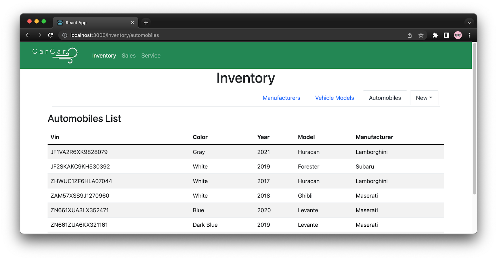

### Services<br>
- Have a mechanic business too?<br>
CarCar will help you manage technicians, times of service, and services performed. This will be stored along side the cars information and the customer who brought it in. We know its a VIP if the car was in our inventory before.
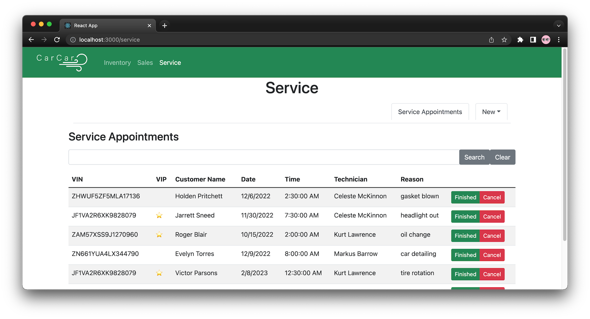

### Sales<br>
- ...But wait, there's more!<br>Easily keep track of employees, sales, and yes, even employee's sales. Get rid of that old Incorruptible Cashier and subscribe to CarCar! (only $45.99 a month or save money with our yearly subscription $535/year)
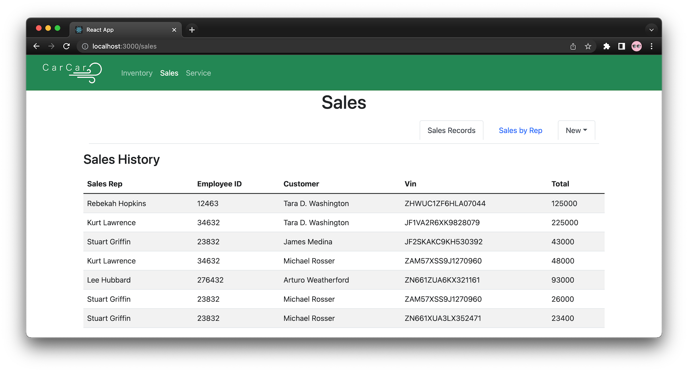

## How To Run It

---

### Requirements:

1. [Python 3](https://www.python.org/downloads/)
2. [Docker Desktop](https://www.docker.com/products/docker-desktop/)
3. [VSCode](https://code.visualstudio.com/)

### Start the app:

1. Clone the repository:<br>`git clone https://gitlab.com/leweymelchor/project-beta.git`
2. Change to project diectory:<br>`cd project-beta`
3. Open project<br>`code .`
4. Open Docker app
5. Open VSCode terminal  to top level directory<br>`control + \`
6. Build docker containers & run:<br>
    `docker-compose up --build`
7. Open in a browser<br> [http://localhost:3000/](http://localhost:3000/)
8. Take a load off and Enjoy, the hard work is over, now it's our turn!  


## Additional Features

---

### Inventory<br>
- Add a Manufacturer  
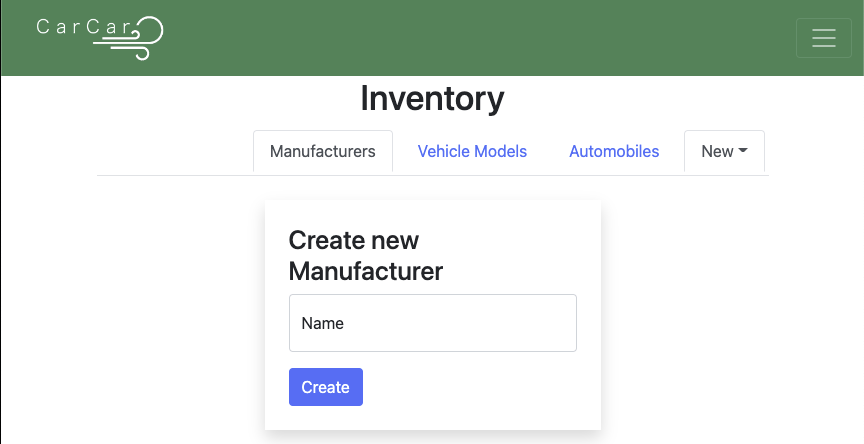

- Add a Vehicle Model  


- Add an Automobile  
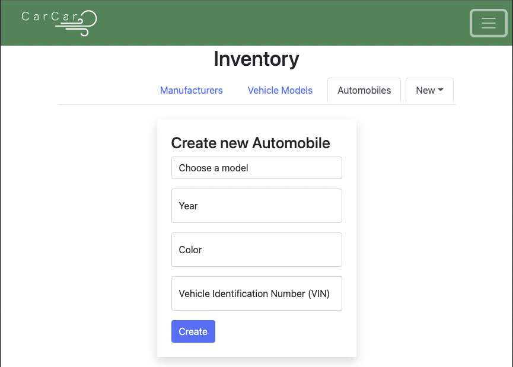

- Show a list of Manufacturers  
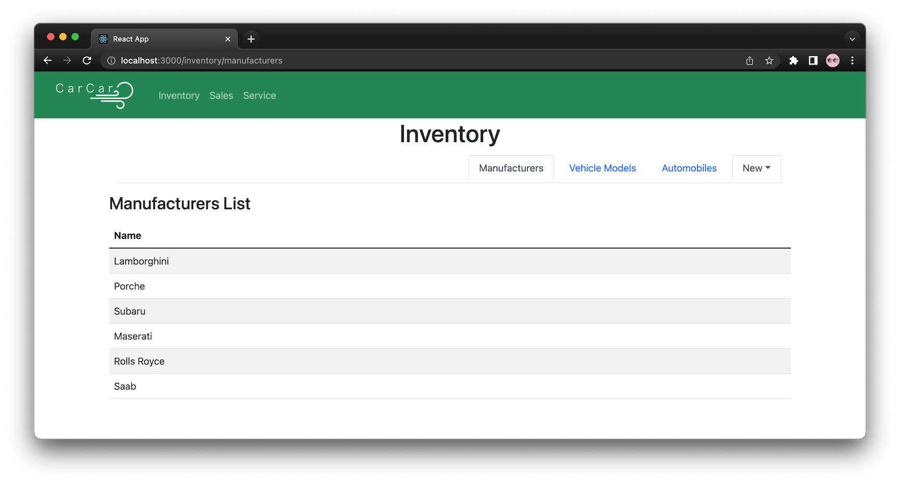

- Show a list of Vehicle Models  
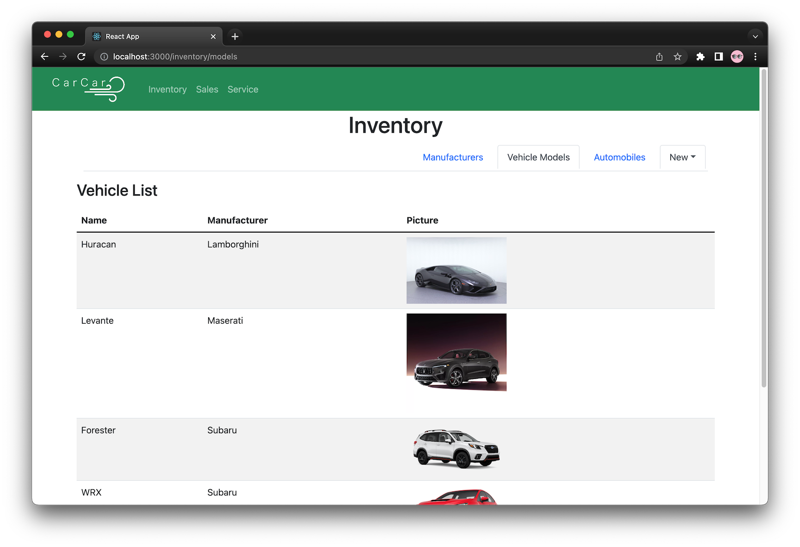


### Services<br>
- Add a Service Technician  
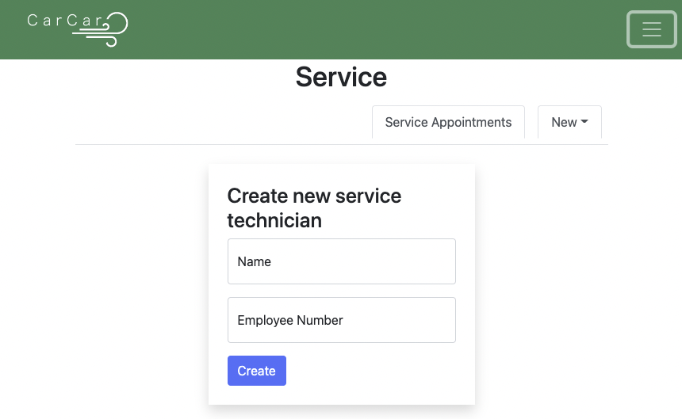

- Create a Service Appointment  
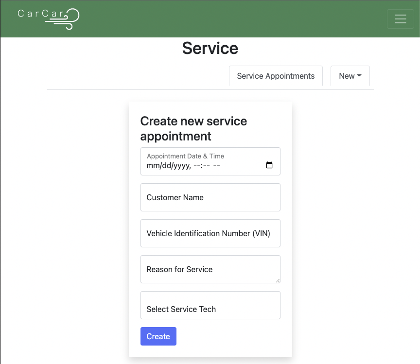

- Search Service History by VIN  
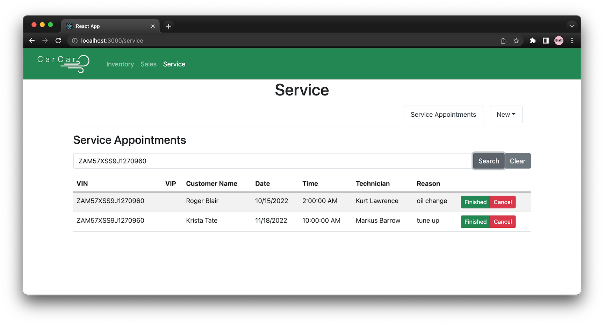

### Sales<br>
- Add a Sales Rep  


- Add a Customer 


- Create a Sales Record  


- Show a Sales Reps Performance  
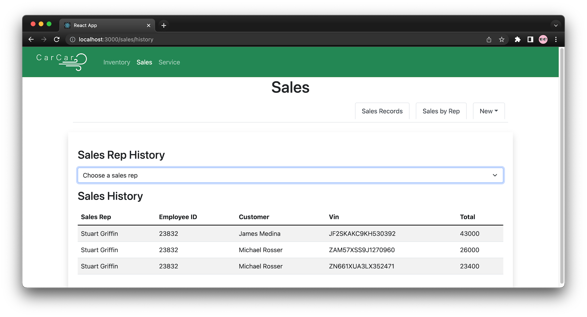


## Architecture

---


### Services - Docker
| Service | Image | Notes |
| --- | --- | --- |
| react | node | img tag: 12.2-bullseye |
| | |ports: 3000:3000 |
| database | postgres | img tag: 14.2-bullseye |
| | | ports: 15432:5432 |
| | | volume: beta-data |
| inventory-api | project-beta-inventory-api | ports: 8100:8000 |
| service-api | project-beta-service-api | ports: 8080:8000 |
| service-poller | project-beta-service-poller |  |
| sales-api | project-beta-sales-api | ports: 8090:8000 |
| sales-poller | project-beta-sales-poller |  |

### API Reference

---


### API Endpoints

---

### Inventory
- `http://localhost:8100/`


#### `api/manufacturers/`
`GET` | returns a dictionary with a list of vehicle manufacturers
```json
{
	"manufacturers": [
		{
			"href": URL for manufacturer,
			"id": database id for the manufacturer,
			"name": manufacturer's name
		},
        ...
    ]
}
```

`POST` | creates a new manufacturer
```json
{
    "name": "Honda"
}
```

#### `api/manufacturers/:id/`
`GET` | returns the details for the vehicle model 
`PUT` | updates the properties of a vehicle model
`DELETE` | deletes the instance of vehicle model

#### `api/models/`
`GET` | returns a dictionary with a list of vehicle models
```json
{
	"models": [
		{
			"href": URL for model,,
			"id": database id for the model
			"name": model's name
			"picture_url": URL for image of the model,
			"manufacturer": {
                "href": URL for manufacturer,
                "id": database id for the manufacturer,
                "name": manufacturer's name
			}
		},
        ...
    ]
}
```

`POST` | creates a new vehicle model
```json
{
    "name": "S800",
    "picture_url": "https://www.motortrend.com/uploads/sites/5/2020/04/1968-Honda-S800-Restomod-Danny-Wu-40.jpg",
    "manufacturer_id": 1
}
```

#### `api/models/:id/`
`GET` | returns the details for the vehicle model 
`PUT` | updates the properties of a vehicle model
`DELETE` | deletes the instance of vehicle model

#### `api/automobiles/`
`GET` | returns a dictionary with a list of automobiles
```json
{
	"autos": [
		{
			"href": "/api/automobiles/JF1VA2R6XK9828079/",
			"id": 1,
			"color": "Gray",
			"year": 2021,
			"vin": "JF1VA2R6XK9828079",
			"model": {
                "href": URL for model,,
                "id": database id for the model
                "name": mmodel's name
                "picture_url": URL for image of the model,
                "manufacturer": {
                    "href": URL for manufacturer,
                    "id": database id for the manufacturer,
                    "name": manufacturer's name
                }
		    },
		},
        ...
    ]
}
```

`POST` | creates a new automobile
```json
{
    "color": "red",
    "year": 2012,
    "vin": "1C3CC5FB2AN120174",
    "model_id": 1}
```

#### `api/models/:vin/`
`GET` | returns the details for the vehicle model 
`PUT` | updates the properties of a vehicle model
`DELETE` | deletes the instance of vehicle model

---

### Service
- `http://localhost:8080/`
#### `api/techs/`
`GET` | returns a dictionary with a list of technicians
````json
{
    "techs": [
        {
            "id": database id for the technician,
            "name": technician's name,
            "employee_number": technician's employee number,
        },
        ...
    ]
}
````

`POST` | creates a new service technician
```json
{
    "name": "Kurt Lawrence",
    "employee_number": 30
}
```

#### `api/services/` 
`GET` | returns a dictionary with a list of service appointments
```json
{
    "appointments": [
        {
        "href": URL to the appointment,
        "id": database id for the appointment,
        "vin": vehicle identification number (vin) of the car,
        "owner": name of the car owner/customer,
        "date_time": date & time of the appointment,
        "tech": {
            "id": database id for the technician,
            "name": technician's name,
            "employee_number": the technician's employee number,
        },
        "status": status of the appointment; defaults to "PENDING",
        "reason": description of the reason for appointment,
        "vip": if the car was purchased from the dealership & requires VIP treatment;
            references if vin matches Inventory database via AutomobileVO,
            otherwise defaults to "False"
        },
        ...
    ]
}
```

`POST` | creates a new service appointment instance
```json
{
    "vin": "ZHWUT4ZF6LLA14649",
    "owner": "Emilia Seay",
    "date_time": "2022-10-28 12:00",
    "tech": 30,
    "reason": "Tire rotation"
}
```  

#### `api/services/:id` 
`GET` | returns the details for the service appointment instance
```json
{
    "href": URL to the appointment,
    "id": database id for the appointment,
    "vin": vehicle identification number (vin) of the car,
    "owner": name of the car owner/customer,
    "date_time": date & time of the appointment,
    "tech": {
        "id": database id for the technician,
        "name": technician's name,
        "employee_number": the technician's employee number,
    },
    "status": status of the appointment; defaults to "PENDING",
    "reason": description of the reason for appointment,
    "vip": if the car was purchased from the dealership & requires VIP treatment;
        references if vin matches Inventory database via AutomobileVO,
        otherwise defaults to "False"
}
```

`PUT` | updates the properties of a service appointment object
```json
{
    "status": "FINISHED"
}
```

---

### Sales
- `http://localhost:8090/`

#### `api/sales_rep/`
`GET` | returns a dictionary with a list of service reps
```json
{
	"sales_reps": [
        {
            "id": database id for the technician,
            "name": sales rep's name,
            "employee_id": technician's employee number
        },
        ...
    ]
}


`POST` | creates a new service rep
```json
{
	"name": "Nomar Norman",
	"employee_id": "12"
}
```

#### `api/customer/`
`GET` | returns a dictionary with a list of customers
```json
{
	"customers": [
        {
            "id": database id for the technician,
            "name": customer's name,
            "address": customer's address,
            "phone_number": customer's phone number,
        },
        ...
    ]
}

`POST` | creates a new service appointment instance
```json
{
  "name": "Bargain Bob",
	"address": "123 Sesame St",
	"phone_number": 5672347890
}
```

#### `api/sales/`
`GET` | returns a dictionary with a list of sales records
```json
{
	"sales": [
		{
			"id": database id for the sales record,
			"total": sale cost,
			"sales_rep": {
				"id": database id for the technician,
				"name": sales rep's name,
				"employee_id": technician's employee number
			},
			"customer": {
				"id": database id for the technician,
				"name": customer's name,
				"address": customer's address,
				"phone_number": customer's phone number,
			},
			"automobile_vo": {
				"vin": vin of the purchased car
			}
		},
        ...
    ]
}
```

`POST` | creates a new sales record instance
```json
{
	"total": 35000,
	"sales_rep": 1,
	"customer": 1,
	"automobile_vo": 1
}
```
